<h1 align="center">
<br>
  <a href="">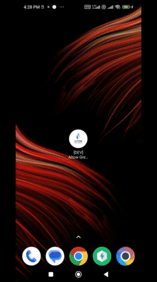</a>

  <br>
</h1>

# Altow Greenhouse Job Search App

---

A minimal Job Search app made with <a href="https://flutter.dev" target="_blank">Flutter</a> to Easily Search and view jobs using Greenhouse API.the app automatically store jobs to view later in it's reactive database.

you can find a video recording of the working app in the following links:

- <a href="https://drive.google.com/file/d/1Lti3lblSnHyOuVtDS91eq4UNxk1RdXBH/view?usp=sharing" target="_blank">Video Recording</a>

## Table of Content

- [Key Features](#key-features)
- [How To Use](#how-to-use)
- [Introduction](#introduction)
  - [Architecture](#architecture)
    - [Core](#core)
    - [Features](#features)
      - [Data](#data)
      - [Domain](#domain)
      - [Presentation](#presentation)
  - [Technical Choices](#technical-choices)
    - [Packages and Plugins](#packages-and-plugins)

## Key Features

- Fetch Job advertisement data from Greenhouse job board API and save it to local `reactive database`.
- Change app localization. currently, the app supports `German` and `English`.

## [](https://drive.google.com/file/d/1Lti3lblSnHyOuVtDS91eq4UNxk1RdXBH/view?usp=sharing)

<table>
  <tr>
    <td>
        <h5>Splash Screen</h5>
    </td>
    <td>
        <h5>Main page</h5>
    </td>    
    <td>
        <h5>Messages page</h5>
    </td>
    <td>
        <h5>Account Setting page</h5>
    </td>      
   </tr>

  <tr>
    <td> 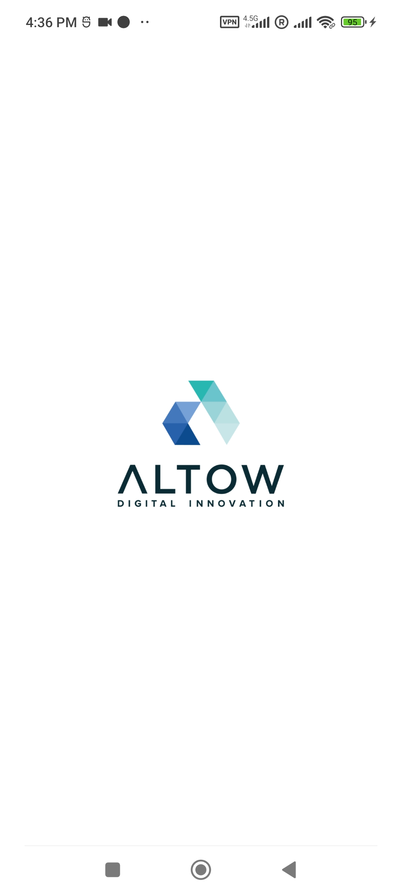</td>
    <td> 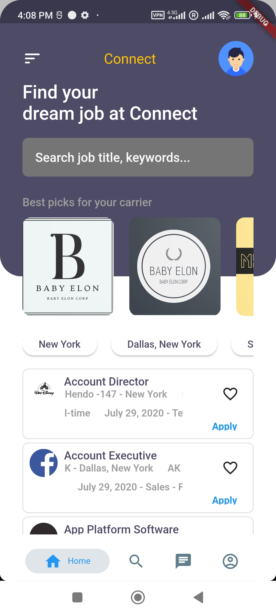</td>
    <td> </td> 
    <td> 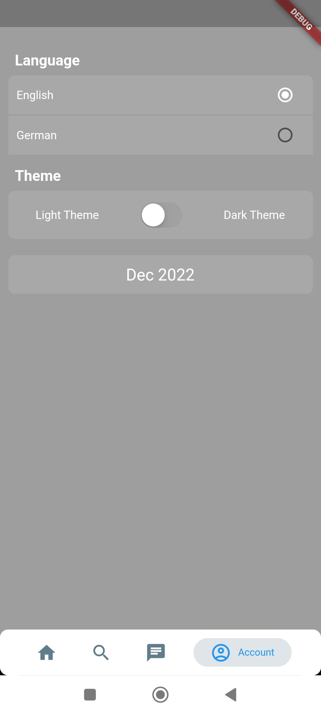</td>   
   </tr>

  <tr>
    <td>
        <h5>Search jobs</h5>
    </td>
    <td>
        <h5>Empty search result</h5>
    </td>    
    <td>
        <h5>Search with result</h5>
    </td>
    <td>
        <h5>Change Localization</h5>
    </td>      
   </tr>

  <tr>
    <td> 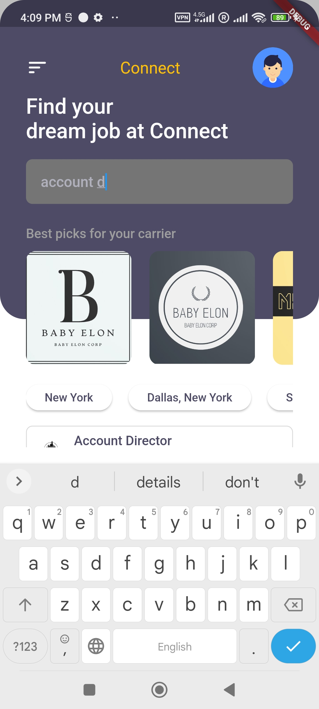</td>   
    <td> 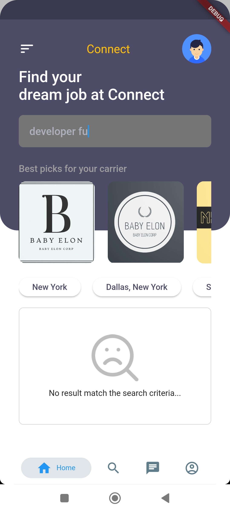</td>  
    <td> 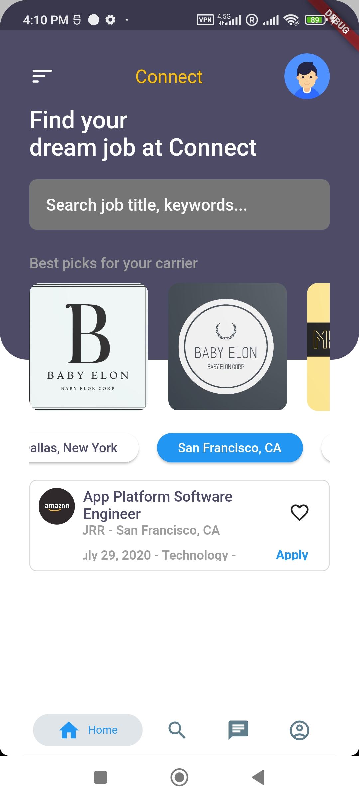</td>  
    <td> 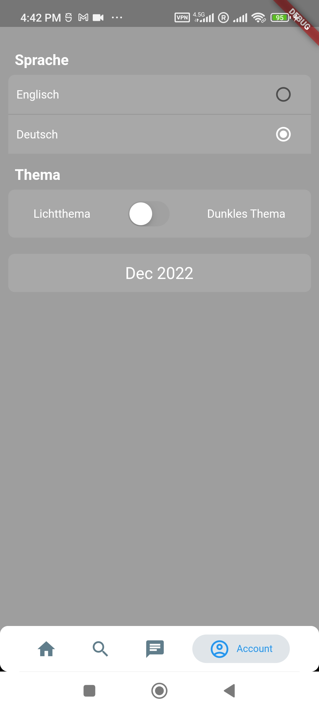</td>   
   </tr>

  <tr>
    <td>
        <h5>German Main page</h5>
    </td>
  </tr>
    <tr>
    <td> 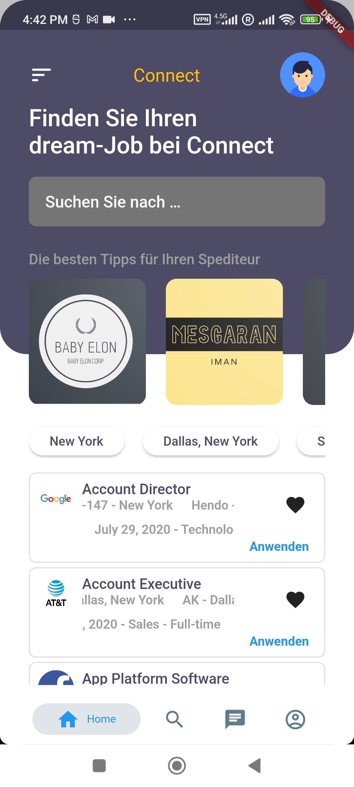</td>    
   </tr>
</table>

## Getting Started 🚀

This project contains 3 flavors:

- development
- staging
- production

To run the desired flavor either use the launch configuration in VSCode/Android Studio or use the following commands:

```sh
# Development
$ flutter run --flavor development --target lib/main_development.dart

# Staging
$ flutter run --flavor staging --target lib/main_staging.dart

# Production
$ flutter run --flavor production --target lib/main_production.dart
```

_\*Altow Greenhouse Job Search App works on iOS, Android, Web, and Windows._

---

## How To Use

To clone and run this application, you'll need [Git](https://git-scm.com) and [Flutter](https://flutter.dev/docs/get-started/install) installed on your computer. From your command line:

```bash
# Clone this repository
$ git clone https://github.com/ImanMesgaran/altow_greenhouse_jobs.git

# Go into the repository
$ cd altow_greenhouse_jobs

# Install dependencies
$ flutter packages get

# Run the app
$ flutter run
```

if dart analysis show errors in "Problems" console, you can run and debug the app without any issue.
but to make the fake errors go away, you should restart dart analysis server:
On Mac:
"command" + "shift + "p" => Dart: Restart Analysis Server

## Introduction

the purpose of this code is to demonstrate how to interact with greenhouse.io API and save results in a reactive database using "Altow Greenhouse Job Search" app written in Dart & Flutter, following Clean-Architecture.

### Architecture

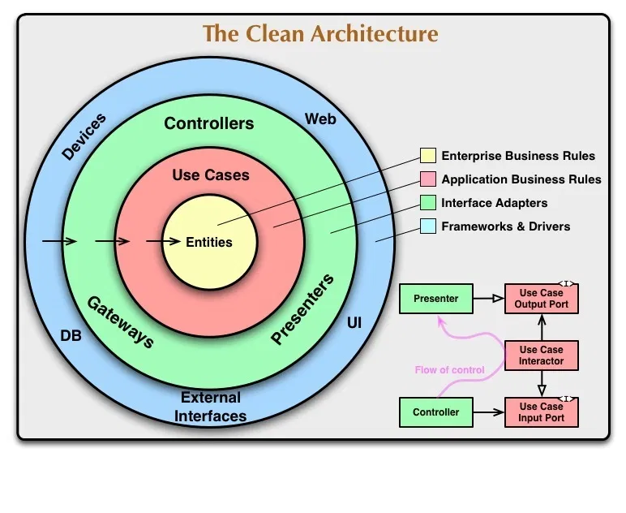

as demonstrated by Clean Architecture approach guild-lines and Instructions:

> Keeping the code clean and tested are the two most important development practices. In Flutter, this is even more true than with other frameworks. On one hand, it's nice to hack a quick app together, on the other hand, larger projects start falling apart when we mix the business logic everywhere. Even state management patterns like Riverpod are not sufficient in themselves to allow for easily extendable codebase.

> we should all strive to separate code into independent layers and depend on abstractions instead of concrete implementations.


#### Core

core folder, contains all parts of the code that can be reused throughout the code base and the project. things like Colors, Text-Styles, helper & static classes and Utils, Widgets ,and Networking base classes and interceptors.

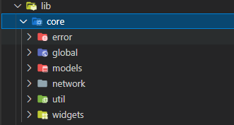

#### Features

each separate and major functionality of the app, should be fold and interact in it's own Feature which is divide into 3 layers, presentation, domain and data.

currently, there is only one feature to the app which is `Job Explorer` functionality:

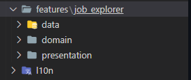

##### Presentation

> This is the stuff we're used to from "unclean" Flutter architecture. we obviously need widgets to display something on the screen. These widgets then dispatch events to the Riverpod and listen for states (or an equivalent if we don't use Riverpod for state management).

<p float="left">
  <center>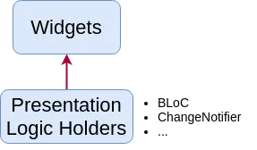</center>
</p>

##### Domain

> Domain is the inner layer which shouldn't be susceptible to the whims of changing data sources. It will contain only the core business logic (use cases) and business objects (entities). It should be totally independent of every other layer.

<p float="left">
  <center>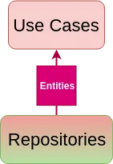</center>
</p>

##### Data

> The data layer consists of a Repository implementation (the contract comes from the domain layer) and data sources - one is usually for getting remote (API) data and the other for caching that data.

<p float="left">
<center>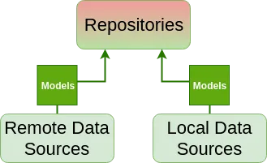</center>
</p>

### Technical Choices

### Packages and Plugins

- **_drift_**: Reactive persistence library for Flutter and Dart, built on top of sqlite.

```
@DataClassName('JobDataModel')
class JobsTable extends Table {
  IntColumn get id => integer()();
  TextColumn get jobJson => text().map(const JobModelConverter()).nullable()();

  @override
  Set<Column> get primaryKey => {id};
}
```

```
  /// insert multiple jobs into database
  Future<void> insertJobs({required List<JobModel> jobs}) async {
    for (var i = 0; i < jobs.length; i++) {
      into(jobsTable).insert(
        mode: InsertMode.insertOrReplace,
        JobDataModel(
          id: jobs[i].id,
          jobJson: jobs[i],
        ),
      );
    }
  }
```

- **_get_it_**: this is a simple package to use for Dependency Injection.

  things like Services, and use-cases are available in the code base through DI:

  ```
  import '../../../../injection_container.dart' as di;

  // * Data Sources
  // ! Job Board DataSources
  getIt.registerLazySingleton<JobsRemoteDataSource>(
    () => JobsRemoteDataSourceImpl(
      client: getIt(),
    ),
  );

  getIt.registerLazySingleton<JobsLocalDataSource>(
      () => JobsLocalDataSourceImpl(database: getIt()));

  ```

  these are declared in `injection_container.dart` file.

register Drift database as a `singleton`:

```
//! External
getIt.registerLazySingleton<MyDatabase>(() => MyDatabase());

```

- **_dartz:_** for using Functional Programming goodies in the app.

```
class GetJobs {
  final JobsRepository repository;

  GetJobs(this.repository);

  Future<Either<Failure, List<JobModel>?>> call() async {
    var result = await repository.getJobs();
    return result;
  }
}
```

- **_dio:_** currently, the best plugin for network api connection for flutter with lots of out-of-the-box tools and features.

- **_retrofit:_** dio client generator.

- **_freezed:_** code generator for data-classes/unions/pattern-matching/cloning.

## Working with Translations 🌐

This project relies on [flutter_localizations][flutter_localizations_link] and follows the [official internationalization guide for Flutter][internationalization_link].

### Adding Strings

1. To add a new localizable string, open the `app_en.arb` file at `lib/l10n/arb/app_en.arb`.

```arb
{
    "@@locale": "en",
    "bestPicksText": "Best picks for your carrier",
    "@bestPicksText": {
        "description": "Text shown in title of best picks section"
    }
}
```

2. Use the new string

```dart
import 'package:altow_greenhouse_jobs/l10n/l10n.dart';

@override
Widget build(BuildContext context) {
  final l10n = context.l10n;
  return Text(l10n.bestPicksText);
}
```

### Adding Translations

1. For each supported locale, add a new ARB file in `lib/l10n/arb`.

```
├── l10n
│   ├── arb
│   │   ├── app_en.arb
│   │   └── app_es.arb
```

2. Add the translated strings to each `.arb` file:

`app_en.arb`

```arb
{
    "@@locale": "en",
    "bestPicksText": "Best picks for your carrier",
    "@bestPicksText": {
        "description": "Text shown in title of best picks section"
    }
}
```

`app_de.arb`

```arb
{
    "@@locale": "de",
    "bestPicksText": "Die besten Tipps für Ihren Spediteur",
    "@bestPicksText": {
        "description": "Text, der im Titel des Abschnitts mit den besten Tipps angezeigt wird"
    }
}
```

[coverage_badge]: coverage_badge.svg
[flutter_localizations_link]: https://api.flutter.dev/flutter/flutter_localizations/flutter_localizations-library.html
[internationalization_link]: https://flutter.dev/docs/development/accessibility-and-localization/internationalization
[license_badge]: https://img.shields.io/badge/license-MIT-blue.svg
[license_link]: https://opensource.org/licenses/MIT
[very_good_analysis_badge]: https://img.shields.io/badge/style-very_good_analysis-B22C89.svg
[very_good_analysis_link]: https://pub.dev/packages/very_good_analysis
[very_good_cli_link]: https://github.com/VeryGoodOpenSource/very_good_cli
